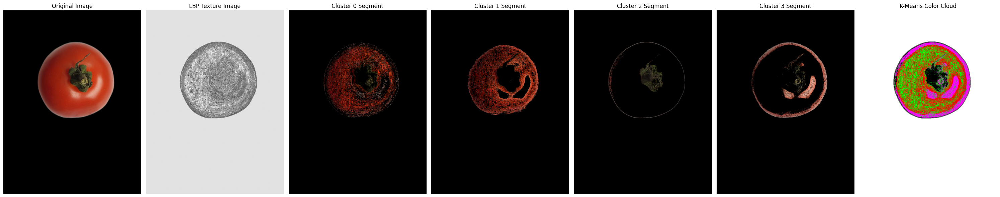

# Advanced Tomato Segmentation with Background Removal

This project provides a Python-based solution for **automatic background removal** and **advanced color segmentation** of tomato images. It segments tomatoes into **red/orange**, **green/yellow**, and **defect (dark/black)** regions, using refined color ranges, region approximation, and visualization with a clean white background.

The project is designed for batch image processing and works seamlessly in **Google Colab** or any Python environment.

---

## Features

- **Automatic Background Removal** using the `rembg` library.
- **Alpha Matte Support** for smooth edges and clean masking.
- **Advanced Tomato Color Segmentation** into red/orange, green/yellow, and defect regions.
- **Region Approximation** to fill undefined areas for better segmentation.
- **Color Cloud Visualization** with white background for clarity.
- **Batch or Single Image Processing**.
- **Supports Common Image Formats**: `.jpg`, `.jpeg`, `.png`.

---

## Requirements

- Python 3.8+
- OpenCV (`cv2`)
- NumPy (`numpy`)
- Matplotlib (`matplotlib`)
- Rembg (`rembg`)
- Scikit-Image (`scikit-image`)
  
---

## How It Works
- Load Image: Input tomato image in BGR format.
- Background Masking: Isolate the fruit from the background using grayscale thresholding and morphological operations.
- Color Segmentation: Define HSV ranges for red/orange, green/yellow, and defect regions. Apply masks.
- Region Approximation: Fill unclassified areas using neighboring pixel regions.
- Visualization: Create a color-coded "Color Cloud" image with white background and optional contour outlining.
- Display: Show original masked image, individual segments, and final color cloud.

---

## Example Input/Output
- Input Image: image_11.jpg
- Output Color Cloud:
- 
  - Red areas: Red/Orange regions of tomato
  - Green areas: Green/Yellow regions
  - Black areas: Defective/dark spots
  - White areas: Background

---

## Notes
- The HSV color ranges may need adjustment depending on the lighting conditions and tomato variety.
- Alpha matte helps produce smoother edges for better segmentation.
- The region approximation step ensures no fruit area is left unclassified.
- Designed for Google Colab but also works locally in Python environments.
